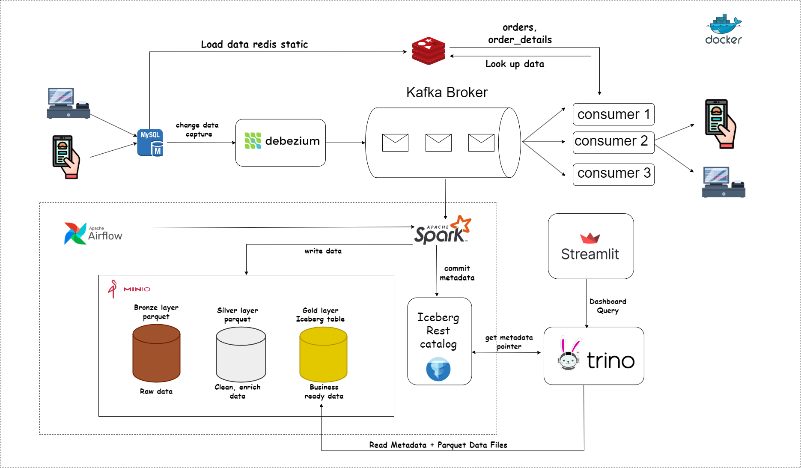

<div align="center">
  <h1>🥐 KD Bakery & Coffee Data Platform ☕</h1>
  <p><i>Nền tảng Dữ liệu End-to-End cho Chuỗi Bakery & Coffee: Real-time Analytics & Batch Processing</i></p>

  <!-- Badges -->
  <p>
    
    
    
    
    
    
    
  </p>
</div>

---

## 📑 Mục lục
- [🌟 Tổng quan Kiến trúc](#-tổng-quan-kiến-trúc)
- [🚀 0. Chuẩn bị Môi trường](#-0-chuẩn-bị-môi-trường)
- [⚡ 1. Luồng Real-time (CDC & AI Gợi ý)](#-1-luồng-real-time-cdc--ai-gợi-ý)
- [📦 2. Luồng Batch Processing (Data Lakehouse)](#-2-luồng-batch-processing-data-lakehouse)
- [📊 3. Streamlit Dashboard Analytics](#-3-streamlit-dashboard-analytics)
- [💡 4. Tóm tắt Lệnh (Cheat-sheet)](#-4-tóm-tắt-lệnh-cheat-sheet)
- [📚 5. Tài liệu Chi tiết](#-5-tài-liệu-chi-tiết)
- [🔧 6. Xử lý Sự cố (Troubleshooting)](#-6-xử-lý-sự-cố-troubleshooting)

---

## 🌟 Tổng quan Kiến trúc

Hệ thống Data Platform được thiết kế chuyên biệt cho chuỗi bán lẻ Bakery & Coffee, kết hợp đồng thời cả 2 luồng xử lý dữ liệu: **Real-time** và **Batch**.




Hệ thống cung cấp ba tính năng cốt lõi:
1. **Quản lý Môi trường Tự động** thông qua script Python mở tự động và Docker Compose stack.
2. **Hệ thống Gợi ý Thời gian Thực** với kiến trúc Event-driven (CDC Debezium + Kafka) phục vụ up-sell & cross-sell.
3. **Data Lakehouse Đám mây Analytics** sử dụng Spark, Iceberg và Trino orchestrate bởi Apache Airflow.

---

## 🚀 0. Chuẩn bị Môi trường

### 0.1 Cài đặt Python Virtual Environment (venv)

Tạo môi trường độc lập chạy các python script và real-time consumers.

<details>
<summary><b>💻 Windows (PowerShell / cmd)</b></summary>

```powershell
python -m venv venv
venv\Scripts\Activate
```
</details>

<details>
<summary><b>🐧 Linux / WSL</b></summary>

```bash
sudo apt update
sudo apt install python-is-python3 python3-venv
python3 -m venv venv
source venv/bin/activate
```
</details>

Cài đặt đầy đủ các thư viện (`requirement.txt`):
```bash
pip install -r requirement.txt
```

### 0.2 Cấu hình `.env`

Tạo file `.env` tại thư mục root (chỉ cần copy từ `env.example`) với các biến thiết yếu:

```env
# MySQL
MYSQL_HOST=localhost
MYSQL_PORT=3306
MYSQL_USER=root
MYSQL_PASSWORD=Ngocquy2501@
MYSQL_DATABASE=kd_bakery_coffee
MYSQL_ROOT_PASSWORD=Ngocquy2501@

# MinIO
MINIO_ENDPOINT=http://minio:9000
MINIO_ROOT_USER=minioadmin
MINIO_ROOT_PASSWORD=minioadmin

# Iceberg / Trino
ICEBERG_REST_URI=http://iceberg-rest:8181
ICEBERG_WAREHOUSE=s3://warehouse/
ICEBERG_CATALOG=iceberg
ICEBERG_NAMESPACE=gold
AWS_REGION=us-east-1
```
> *Lưu ý: Nếu đổi `MYSQL_PASSWORD`, hãy cập nhật luôn file `scripts/real-time/mysql_debezium_connector.json` (thuộc trường `database.password`).*

### 0.3 Triển khai Stack với Docker Compose

Khởi động toàn bộ cụm Services nhanh chóng cho demo:

```bash
docker compose up -d
```

Hoặc có thể bật theo nhóm nếu phát triển cụ thể 1 luồng:
- **Luồng Real-time:** 
  ```bash
  docker compose up -d mysql kafka-1 kafka-2 kafka-3 init-kafka kafka-ui connect redis
  ```
- **Luồng Batch Analytics:**
  ```bash
  docker compose up -d postgres airflow-init airflow-scheduler airflow-webserver spark-master spark-worker minio minio-init iceberg-rest trino streamlit
  ```

Kiểm tra healthcheck đảm bảo các services chạy tốt:
```bash
docker compose ps
```

### 0.4 Bảng Cổng Truy cập Dịch vụ (Ports List)

| Dịch vụ             | Đường dẫn URL              | Thông tin Đăng nhập (Credentials)      |
| ------------------- | -------------------------- | ------------------------------------- |
| 🗄️ **Adminer** (MySQL)| http://localhost:8080      | Server: `mysql` <br> Username: `root` |
| 🎧 **Kafka UI**       | http://localhost:8000      | *Không yêu cầu*                       |
| 🔌 **Kafka Connect**  | http://localhost:8083      | *Không yêu cầu*                       |
| 🔴 **Redis Insight**  | http://localhost:8001      | *Không yêu cầu*                       |
| 🪣 **MinIO Console**  | http://localhost:9001      | `minioadmin` / `minioadmin`           |
| 🧊 **Iceberg REST**   | http://localhost:8181      | *Không yêu cầu* (`/v1/config`)        |
| 🐇 **Trino UI**       | http://localhost:8090      | Username: `dashboard`                 |
| ✨ **Spark Master**   | http://localhost:9090      | *Không yêu cầu*                       |
| 🌬️ **Airflow UI**     | http://localhost:8088      | `airflow` / `airflow`                 |
| 📈 **Streamlit**      | http://localhost:8501      | *Không yêu cầu*                       |

---

## ⚡ 1. Luồng Real-time (CDC → Kafka → Redis → Gợi ý)

### 1.1 Khởi tạo Schema và Master Data

Nạp Data Master (Cửa hàng, Khách hàng, Sản phẩm) vào MySQL và Rules lên Redis:

```bash
python scripts/database/create_table.py        # Thiết lập lược đồ
python scripts/database/load_data_static.py    # Load static data (CSV)
python scripts/database/load_redis_static.py   # Tải tier & co-purchase matrix vào Redis
```

### 1.2 Đăng ký Debezium MySQL Connector

Đăng ký JSON config vào Kafka Connect để cấu hình theo dõi Binlog của MySQL Database:

```bash
curl -X POST http://localhost:8083/connectors \
  -H "Content-Type: application/json" \
  -d @scripts/real-time/mysql_debezium_connector.json
```
Verify trạng thái sinh events từ Log Database (mong đợi `RUNNING`):
```bash
curl http://localhost:8083/connectors/mysql_debezium_connector/status
```

### 1.3 Kích hoạt Khối Động cơ Cập nhật Đơn/Gợi ý Recommender

Mở **3 terminal** khác nhau, nhớ `source venv/bin/activate` trên mỗi terminal:

```bash
# Terminal 1 - Theo dõi sự kiện đơn hàng (Orders)
python scripts/real-time/consumer_orders.py

# Terminal 2 - Theo dõi sự kiện chi tiết đơn hàng (Order_Details)
python scripts/real-time/consumer_order_details.py

# Terminal 3 - Khởi chạy Rule Engine (Discount & Recommend R1/R2/R3)
python scripts/real-time/order_ready_for_rcm.py
```

### 1.4 Sinh Data Đơn Hàng Giả Lập Bán Hàng

Chạy script tạo lập liên tục đơn hàng giả:
```bash
python scripts/database/generate_data.py
```
> *Bạn có thể theo dõi trực tiếp các messages đi qua tại [Kafka UI](http://localhost:8000) và key Redis biến đổi tại [Redis Insight](http://localhost:8001).*

---

## 📦 2. Luồng Batch Processing (Data Lakehouse)

Pipeline dữ liệu sử dụng PySpark theo kiến trúc Medallion, điều phối bởi Airflow.

### 2.1 Kích hoạt Airflow DAG

1. Mở [Airflow UI](http://localhost:8088), đăng nhập bằng (`airflow/airflow`).
2. Tìm DAG **`spark-batch-job`**.
3. Toggle Un-pause phía bên trái và chọn **▶ Trigger DAG**.

Pipeline xử lý tập hợp 3 bước nối tiếp:

| Phân lớp (Layer)| Task Script | Kết quả Đầu ra (Data Lake / Warehouse) |
| :--- | :--- | :--- |
| 🥉 **Bronze** | `scripts/batch_layer/bronze_raw.py` | S3 Parquet tại bucket `s3a://bronze-raw/...` |
| 🥈 **Silver** | `scripts/batch_layer/silver_layer.py`| S3 Parquet đã Transform tại `s3a://silver/silver/...` |
| 🥇 **Gold** | `scripts/batch_layer/gold_layer.py` | Bảng Iceberg hoàn chỉnh tại namespace `iceberg.gold` |

### 2.2 Xem & Tiến hành Giám sát

- Audit quá trình Extract-Load ở **Airflow > DAG Runs > Logs**.
- Xem tổng quan Memory Task Executor tại [Spark Master UI](http://localhost:9090).
- Check Data Warehouse Buckets ở [MinIO Console](http://localhost:9001).

### 2.3 Thực thi Spark Batch Thủ Công (Tùy chọn Debug)

Ví dụ script chạy luồng Gold-Layer không thông qua Airflow:
```bash
docker exec -it spark-master /opt/bitnami/spark/bin/spark-submit \
  --master spark://spark-master:7077 \
  --packages org.apache.iceberg:iceberg-spark-runtime-3.5_2.12:1.9.2,org.apache.iceberg:iceberg-aws-bundle:1.9.2,org.apache.hadoop:hadoop-aws:3.3.1 \
  /opt/airflow/project/scripts/batch_layer/gold_layer.py
```

### 2.4 Đảm bảo Kết quả Dữ Liệu Lakehouse (Bằng Query Trino)

```bash
docker exec -it trino trino --execute "SHOW TABLES IN iceberg.gold"
docker exec -it trino trino --execute "SELECT order_date, SUM(subtotal) AS doanh_thu FROM iceberg.gold.fact_orders GROUP BY 1 ORDER BY 1 DESC LIMIT 10"
```

---

## 📊 3. Streamlit Dashboard Analytics

Giao diện trực quan hoá phục vụ phân tích Business Intelligence chuyên sâu, Dashboard đã chạy sẵn ở port 8501.  
Truy cập: **[http://localhost:8501](http://localhost:8501)**

### 3.1 Khám phá Insight với Dashboard

| Tên Tab / Biểu đồ           | Ý nghĩa Nghiệp vụ & Nội dung Cung cấp                                    |
| ----------------- | ------------------------------------------------------------------------- |
| 📈 **Tổng quan**     | KPI Point-of-Time + xu hướng doanh thu (MA7) + Tỷ trọng đóng góp + Insight Tự động sinh. |
| 🛍️ **Sản phẩm**      | Đồ thị phân tích Cửa hàng Pareto 80/20 + Ranking Performance + Ma trận Giá × Sản lượng.        |
| 🏪 **Cửa hàng**      | Xếp hạng Leaderboard Outlet + Tương quan Lưu lượng (Traffic Metric) × AOV. |
| 👥 **Khách hàng**    | Phân phối Thành viên Tier Matrix + Lịch sử Cống hiến VIP + Biểu đồ tần suất. |
| ⏰ **Hành vi**       | Bản đồ nhiệt (Heatmap) Mua Sắm chuyên sâu theo Thứ/Giờ + Phương thức thanh toán ưu tiên. |
| ✨ **AI Gợi ý**      | Tác động KPI cụ thể của Mô hình Recommendations (Lift) và Phân bổ Store Adoption.     |

> 💡 **Tip:** Streamlit dùng cache TTL `5 phút`. Nếu bạn vừa thực thi chạy Batch thành công, nhấn vào phím **🔄 Refresh cache** (bên Sidebar của ứng dụng Streamlit) để cập nhật Data Visualization ngay.

### 3.2 Khởi chạy Dashboard Độc lập Local

```bash
source venv/bin/activate

export TRINO_HOST=localhost
export TRINO_PORT=8090
export TRINO_CATALOG=iceberg
export TRINO_SCHEMA=gold

streamlit run scripts/dashboard/app.py
```

---

## 💡 4. Tóm tắt Lệnh Lập Trình (Cheat-sheet)

```bash
# === 1. TẠO MÔI TRƯỜNG ===
python3 -m venv venv && source venv/bin/activate
pip install -r requirement.txt
docker compose up -d

# === 2. SETUP REAL-TIME RECSYS ENGINE ===
python scripts/database/create_table.py
python scripts/database/load_data_static.py
python scripts/database/load_redis_static.py
curl -X POST http://localhost:8083/connectors -H "Content-Type: application/json" -d @scripts/real-time/mysql_debezium_connector.json

# (Trên 3 terminal riêng biệt)
python scripts/real-time/consumer_orders.py
python scripts/real-time/consumer_order_details.py
python scripts/real-time/order_ready_for_rcm.py

# Sinh Data Đơn Liên Tục
python scripts/database/generate_data.py

# === 3. KIẾN TẠO BATCH LAKEHOUSE ===
# Truy cập Airflow UI (http://localhost:8088) -> Bật & Kích hoạt Run DAG `spark-batch-job`
# Xem Result Dashboard ở Port `8501`.
```

---


---
<div align="center">
  <p>Được phát triển và thiết kế hạ tầng cho <b>KD Bakery & Coffee</b> © 2026</p>
  <p>🛠 Khung phần mềm phân tích dữ liệu mở. Mọi đóng góp xin vui lòng gửi <a href="#">Pull Request</a>.</p>
</div>
